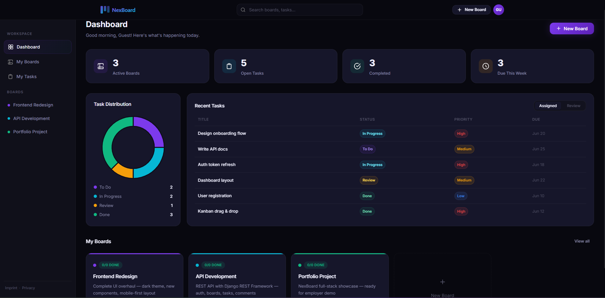
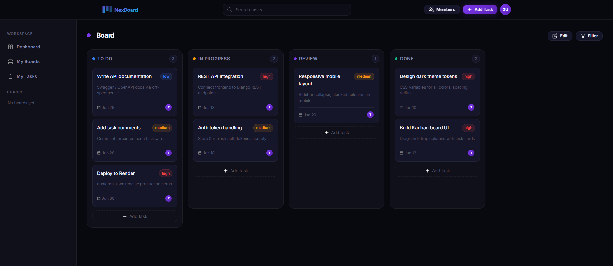

# 

The frontend for **NexBoard** — a full-stack Kanban board application built with Vanilla JavaScript and a Django REST Framework backend.

[](LICENSE)
[](https://developer.mozilla.org/en-US/docs/Web/JavaScript)
[](https://developer.mozilla.org/en-US/docs/Web/HTML)
[](https://developer.mozilla.org/en-US/docs/Web/CSS)

**[Live Demo](https://nexboard-frontend.onrender.com)** · **[API Docs](https://nexboard-backend-ld7s.onrender.com/api/docs/)** · **[Backend Repository](https://github.com/TakouaJelassi/Nexboard_Backend)**

> The backend runs on Render's free tier and may take ~30s to wake up on first visit.

---

## Preview


*Dashboard — task stats, distribution chart, and recent tasks overview.*


*Kanban board — four columns with task cards, priority badges, and due dates.*

---

## Features

- **Dashboard** — overview of active boards, open tasks, completions, and due dates at a glance
- **Kanban boards** — drag and drop tasks across To Do, In Progress, Review, and Done columns
- **Task management** — priority levels, due dates, assignees, and reviewers per task
- **Token authentication** — register, login, and guest mode via DRF token auth
- **Responsive layout** — works on desktop and mobile
- **No build step** — plain HTML, CSS, and JavaScript, deployable anywhere

---

## Tech Stack

| Layer    | Technology                   |
| -------- | ---------------------------- |
| Language | Vanilla JavaScript (ES6+)    |
| Markup   | HTML5                        |
| Styles   | CSS3 (modular, no framework) |
| Auth     | Token-based (DRF backend)    |
| Fonts    | Inter (self-hosted)          |
| Hosting  | Render (Static Site)         |

---

## Project Structure

```
nexboard_frontend/
├── index.html              # Landing page
├── pages/
│   ├── login.html
│   ├── register.html
│   ├── dashboard.html
│   ├── boards.html
│   ├── board.html
│   ├── tasks.html
│   ├── imprint.html
│   └── privacy.html
└── assets/
    ├── css/
    │   ├── reset.css
    │   ├── variables.css
    │   ├── layout.css
    │   ├── components.css
    │   └── animations.css
    ├── js/
    │   ├── config.js       # API base URL
    │   ├── templates.js    # HTML template functions
    │   ├── auth.js         # Login / register
    │   ├── main.js         # Shared utilities
    │   ├── dashboard.js
    │   ├── boards.js
    │   ├── board.js
    │   └── tasks.js
    ├── icons/              # SVG icons
    └── fonts/              # Inter (self-hosted)
```

---

## Local Setup

No build step required. Open `index.html` directly in a browser or serve with VS Code Live Server.

Make sure the backend is running at `http://127.0.0.1:8000/api/`  
(see the [backend repository](https://github.com/TakouaJelassi/Nexboard_Backend) for setup instructions).

Before deploying, update the API base URL in `assets/js/config.js`:

```js
const API = 'https://your-backend.onrender.com/api';
```

---

## Deploy

Point any static host (GitHub Pages, Render Static Site, Netlify) to this folder.  
No build command needed — everything is plain HTML/CSS/JS.

---

## Related

- [NexBoard Backend](https://github.com/TakouaJelassi/Nexboard_Backend) — Django REST Framework API

---

## License

MIT License — see the [LICENSE](LICENSE) file for details.

## About the Project

NexBoard started as a way to practice full-stack development end to end — from designing a REST API to building a responsive UI without relying on any framework. The goal was to understand what happens under the hood before reaching for abstractions.

---

## Contact

Takoua Jelassi — takoua.jelassi@gmail.com · [LinkedIn](https://www.linkedin.com/in/takoua-jelassi)
